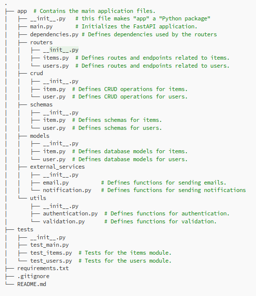
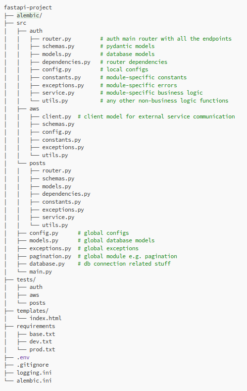

# FAST API
-   A python framework provides a very fast way to prepare backend.
-   FAST API uses Starlette and Uvicorn internally, which are the python frameworks for building asynchronous web services. 
-   Uses thirdpart source OpenAPI for making schema of the apis that we create.
-   We can see the schema of our API at endpoint: {our-endpoint}/openapi.json.
-   OpenAPI calls HTTP methods as "operations".
-   We can return list, dict, or even a singular values like str, int, etc..
-   Even the python ORM objects will also directly converted to JSON format.
-   Uses a pydantic module for data validation.

### Steps to use it?
-   Step-1: Create FastAPI class instance, FastAPI is available in "fastapi" module
-   Step-2: Create path operation [e.g. @app.get(), @app.post(), etc.]
-   Step-3: Create path operation function

### Folder Structure:
-   Structuring based on File-Types

-   Structuring based on Module-Functionality


### Type Hints
-   Specify type hints using ` : ` in python.
-   `var1: int = 1  <- It says var1 should be an integer in further flow of program.`
-   Reference: (type_hints)['https://github.com/Yashu-Simform/Python/blob/b1/README.md#type-hint]
-   Type Hints plays a very important role in FAST API, it provides the thing that is missing i.e. the type checking.


### typing module
-   `Annotated` is used to define the types of the parameters.
-   REMEMBER: we can also add metadata along with the type specification for the parameters.
-   Example: You want to add some validation and specify that the param must be of max length 50.
```
    from typing import Annotated
    from fastapi import FastAPI, Query

    app = FastAPI()

    app.get('/')
    def myhome(q: Annotated[str | None, Query(max_length = 50, min_length = 2)]):
        print(q)

    OR

    def myhome(q: str | None = Query(default=None, max_length=50)):
        print(q)

``` 

-   Here in Annotated the first argument is the actual type of the param, then rest of the data is for additional data is for other tools which can be used as metadata.
-   Here we are using Query because q is a query parameter.
-   When using Query inside the Annotated we can not use default param of the Query.

### Interact with FAST API
-   Need to create FastAPI class instance which provide the instance for you application.
    ```
        from fastapi import FastAPI

        app = FastAPI()
    ```

### Pydantic
-   It is used in order to validate the data and convert it to the appropriate data type annotated using type hints.
-   Some hiearchy to note:
    ```
        Level-0     FieldInfo
                        |   |
        Level-1     Param   Body           
                        |
        Level-2     Path, Query
    ```
-   Function named Field also returns the FieldInfo class.

### Path Parameter
-   Parameters which are explicitly mentioned in the path as a part of the path, and indicating that the param must be included as any value while hitting the URL.
-   ```
        @app.get('/items/{item_id}')
        def get_items(item_id: int):
            return {'data': items[item_id]}
    ```
-   Here item_id is a part of the path or we can say that path is built including the item_id param, thus specified path is incomplete without the item_id.
-   When you try to hit this path without value of item_id it is considered as different path.
-   You can explicitly mention the param as path param by providing the Path() inside the Annotated:
    -   ```
            from fastapi include Path
            from typing include Annotated

            @app.get('/items/{item_id}')
            def get_items(item_id: Annotated[
                int, 
                Path(
                    title="Item ID",
                    description="This param is used in order to query for the particular item",
                    alias="item-id",
                    ge=1,
                    lt=1000
                    # Can have many more arguments
                )
                ]):
                return {'data': items[item_id]}
        ```
        -   alias: used to indicate that name of the specified param should be used while providing values along with the URL.  
        -   ge: greater than or equal to
        -   gt: greater than
        -   le: less than or equal to
        -   lt: less than

### Query Params (are not Path Params)
```
    @app.get('/items/{skip}')
    def get_items(skip: int, limit: int = 10):
        return {'data': items[skip: skip + limit]}
```
-   Here in the above example the skip is path param and limit is query param.
-   Path params are the ones which are specified in the path which are always required with the path.
-   If we need some params to be as functoinal params which are not declared in specified path are called as Query params.
-   To declare the parameter as query parameter just include the Query() inside the Annotated while defining the type of the parameter.
-   These Query params can be decalred for mulitple purposes:
    -   Required Query Params
        -   `q: str | None`: It does not mean that q can be none so its an optional param, thus client can also avoid sending its value! No it's not like that.
        -   It simply mean that we require the param `q` as query param, thus client must need to send the param 'q' even if it is a None value.
    -   Optional Query Parama
    -   Default Query Params
-   Query params are provided after '?' character and seperated by '&' character.
-   eg. 'http://127.0.0.1:8000/items/0?limit=10'

#### Parameter list or mulitple values
```
    app.get('/items')
    def myhome(q: Annotated[list[str] | None, Query()] = None):
        print(q)
```
-   From client side data can be sent as: `http://localhost:8000/items/?q=foo&q=bar`
-   Here we need to declare Query explicitly to declare this q param as query param, otherwise it will be interpreted as request body.

#### Alias for the paramater
-   ```
        app.get('/')
        def myhome(q: Annotated[
            str | None, 
            Query(
                title="Item query",
                description="This param is used in order to query for the particular item",
                alias="item-query",
                pattern="^item",
                deprecated=True,
                )
            ],
            hidden_query: Annotated[str | None, Query(include_in_schema=False)] = None
            ):
            print(q)
    ```

-   The above api can be used as: `http://127.0.0.1:8000/items/?item-query=foobaritems`
-   alias: used to indicate that name of the specified param should be used while providing values along with the URL.  
-   include_in_schema: Used to indicate that param should not be included in the schema made by openAPI.

#### Custom Validation
-   We can use our own custom validations as:
```
import random
from typing import Annotated

from fastapi import FastAPI
from pydantic import AfterValidator

app = FastAPI()

data = {
    "isbn-9781529046137": "The Hitchhiker's Guide to the Galaxy",
    "imdb-tt0371724": "The Hitchhiker's Guide to the Galaxy",
    "isbn-9781439512982": "Isaac Asimov: The Complete Stories, Vol. 2",
}


def check_valid_id(id: str):
    if not id.startswith(("isbn-", "imdb-")):
        raise ValueError('Invalid ID format, it must start with "isbn-" or "imdb-"')
    return id


@app.get("/items/")
async def read_items(
    id: Annotated[str | None, AfterValidator(check_valid_id)] = None,
):
    if id:
        item = data.get(id)
    else:
        id, item = random.choice(list(data.items()))
    return {"id": id, "name": item}
```


### Request body
-   Parameter declared other than query or path paramater are considered as request body.
-   Any param declared as Pydantic model is considered as request body.
-   We can use Body() explicitly while declaring type using Annotated.
    -   ```
            from typing import Annotated
            from fastapi import FastAPI, Body
            from pydantic import BaseModel

            app = FastAPI()

            class Item(BaseModel):
                item_name: str
                item_price: int

            @app.post('/create/item/')
            def create_item(item: Item, user_id: Annotated[int, Body()]):
                print(f'{user_list[user_id]} has created item.')
                print(f'Item Details: {item.dict()}')


            Response:
            {
                "item": {
                    "item_name": "Orange",
                    "item_price": 150
                },
                "user_id": 1
            }
        ```

-   We can send multiple body params simultaneously and FastAPI will give us a request body with keys having same name as params.
-   Now, let's say we have only one request body param and we want response something like:
```
    Response we want:
    {
        "item": {
            "item_name": "Orange",
            "item_price": 150
        }
    }

    Response we get by default:
    {
        "item_name": "Orange",
        "item_price": 150
    }


    class Item(BaseModel):
        item_name: str
        item_price: int

    @app.post('/create/item/')
    def create_item(item: Annotated[Item, Body(embed=True)]):
        print(f'Item Details: {item.dict()}')
```

-   <b>Note: </b> Here Body, Query and Path which we have imported from fastapi class are actually functions which on called returns the instance of the respective classes of the same name.